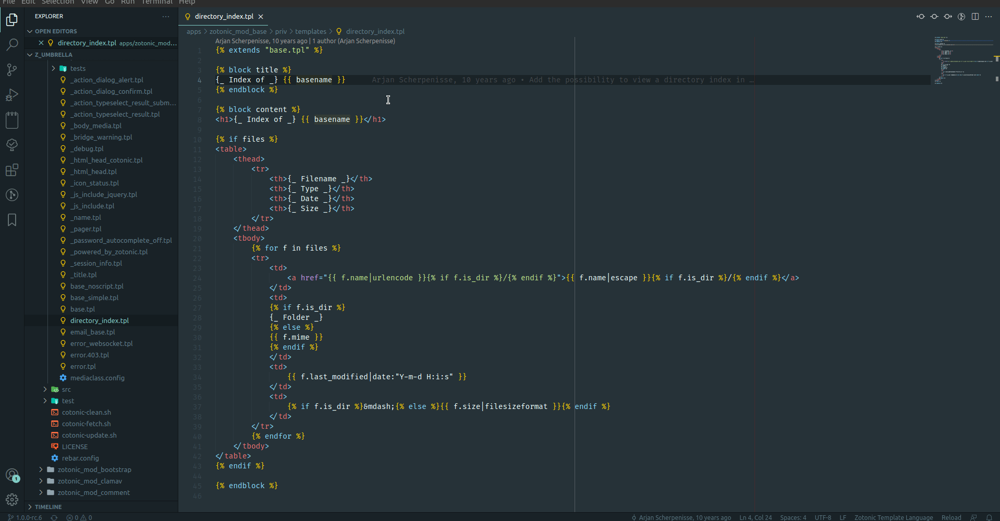

# Zotonic Language Server

Zotonic support for [Language Server Protocol (LSP)](https://microsoft.github.io/language-server-protocol/).
No tests and no improvements were planned or made, only some ideas as code.

## Features

[WIP] [Syntax highlight](https://github.com/williamthome/zotonic-ls/tree/feat/syntax_highlight)\
[ ] Snippets\
[ ] Template search\
[ ] Go to template\
[ ] Docs integration

## Partially working example

## Known Issues

Some mismatches in regex.
