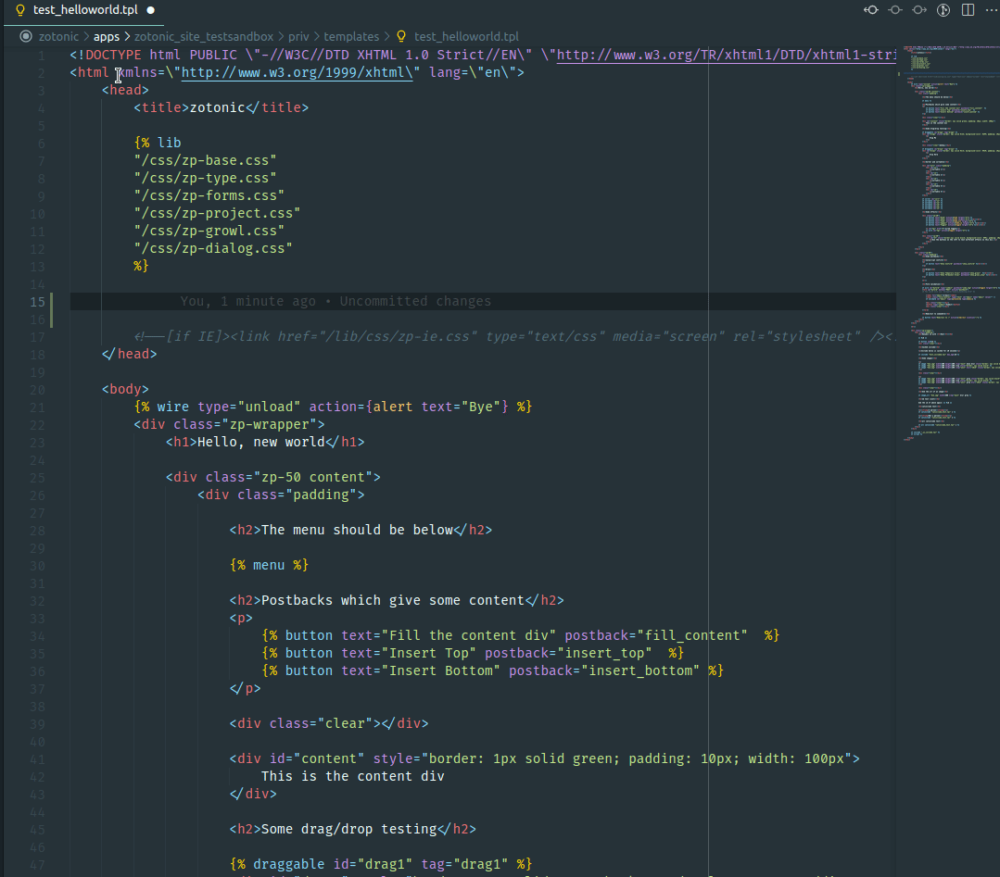
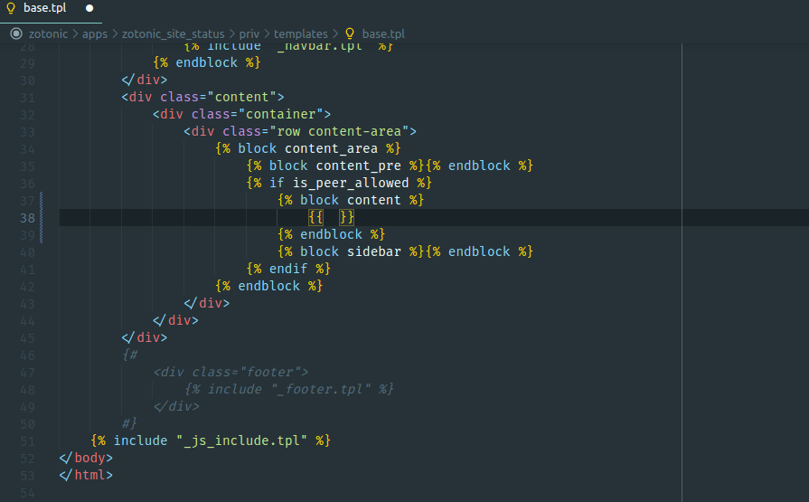
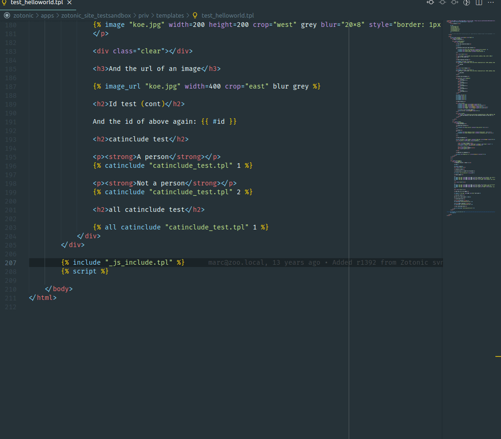
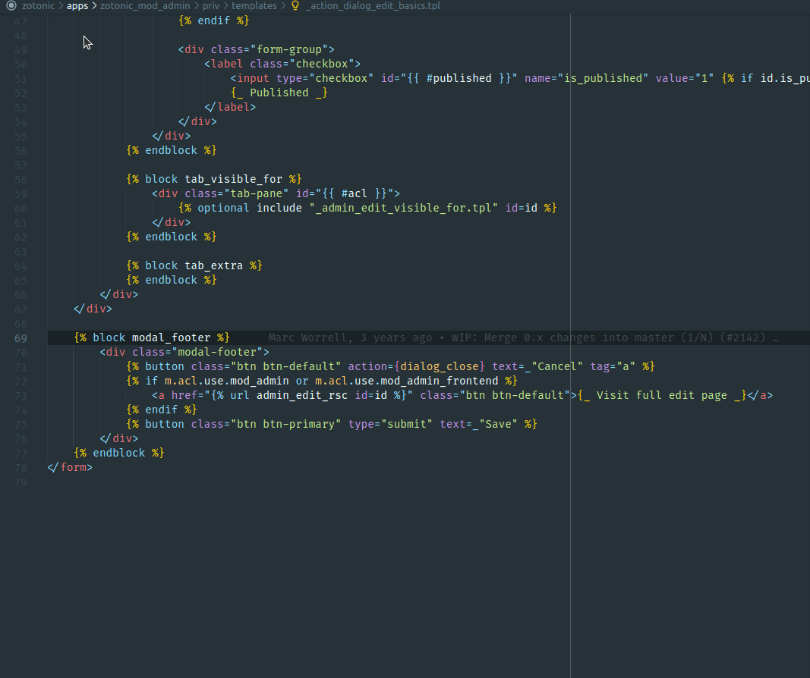

# Zotonic Language Server

Language server for [Zotonic](http://zotonic.com/), the Erlang Web Framework.

## Features

### Syntax highlight

Syntax highlight for Zotonic Template Language (.tpl).


### Snippets

Zotonic completion for `.tpl` and `Erlang` files by pressing <kbd>Ctrl</kbd> + <kbd>Space</kbd>.\
In template files use `act` prefix for [actions](http://docs.zotonic.com/en/latest/ref/actions/), `m` for [models](http://docs.zotonic.com/en/latest/ref/models/), `val` for [validators](http://docs.zotonic.com/en/latest/ref/validators/index.html#validators), `|` for [filters](http://docs.zotonic.com/en/latest/ref/filters/) and for [tags](http://docs.zotonic.com/en/latest/ref/tags/) just the tag name.\
Also some special completions are provided, like the atoms `true`, `false` and `undefined`, `for` loops, `map` tag and more.



#### Models

A great help is the models snippets. Typing `m.` all models are listed and picking one shows all `m_get` possibilities.



#### Other languages completions

- HTML: Typing `<` outside a `.tpl` expression popups HTML snippets.

### Go to definition

Navigate to files in the `.tpl` by pressing <kbd>Ctrl</kbd> + <kbd>Click</kbd> over file names.



### Docs integration

Zotonic documentation is displayed hovering tags, actions, filters, validators, models and translations.



## Todo

### Syntax Highlight

- Improve semantic highlight. See:
  - [Writing a TextMate Grammar: Some Lessons Learned](https://www.apeth.com/nonblog/stories/textmatebundle.html)
  - [Semantic Highlight Guide](https://code.visualstudio.com/api/language-extensions/semantic-highlight-guide)

### Snippets

- Review arguments and tabstops;
- CSS completions;
- Javascript completions.

### Docs

- Review links;
- Improve style.

## Backers

If you like this tool, please consider buying me a coffee ( or more ) as a token of appreciation.\
I'm thankful for your never-ending support.

[](https://www.buymeacoffee.com/williamthome)

## Contributing

### Issues

Feels free to [submit an issue on Github](https://github.com/vscode-django/vscode-django/issues/new).

### Setup

```bash
git clone https://github.com/williamthome/zotonic-ls
cd zotonic-ls
npm install
code .
```

Make sure you have [ESlint](https://marketplace.visualstudio.com/items?itemName=dbaeumer.vscode-eslint) extension installed.

### Debugging the extension

Press <kbd>F5</kbd> to start debugging.
To reload, if in dev window,  press <kbd>Ctrl</kbd> + <kbd>Shift</kbd> + <kbd>F5</kbd> or, if in extension host window, <kbd>Ctrl</kbd> + <kbd>R</kbd>.

[See this article](https://code.visualstudio.com/api/get-started/your-first-extension) for more information about debugging.
